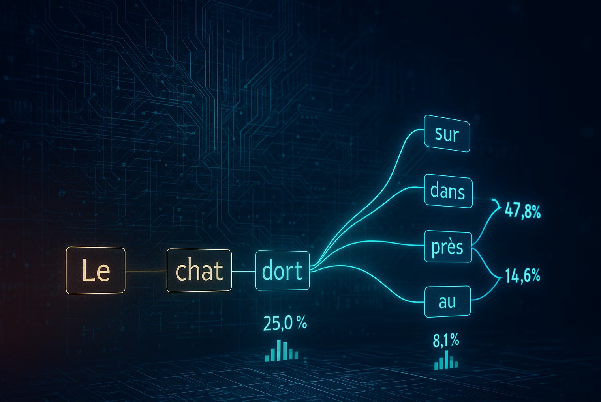
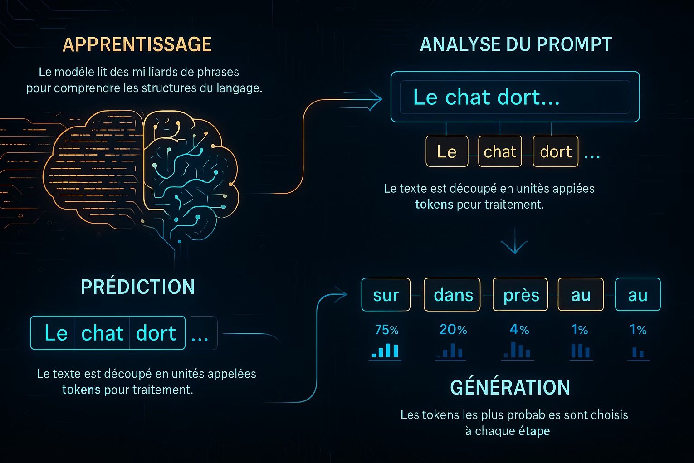
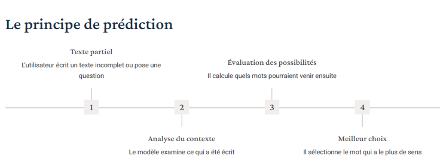
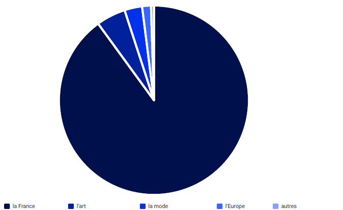
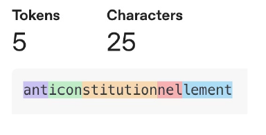

# Introduction (Engineering des prompts)

## Ce que vous apprendrez dans ce module 

### Comprendre les modèles de langage
Découvrez ce que sont les LLM, leur fonctionnement interne et les principes qui
les gouvernent.

### Capacités et limites des LLM
Identifiez ce que ces modèles peuvent faire efficacement et leurs limitations
actuelles.

### Principes du prompt engineering
Apprenez les bases pour formuler des requêtes claires et obtenir des résultats
pertinents.

### Expérimentation pratique
Mettez en pratique vos connaissances avec des exercices guidés et des
expérimentations directes.


## Introduction de 'AI'

### History

1950 - Alan Turing "Turing test" le but est d'évaluer si une machine peut faire preuve d'une intelligence équivalente à celle de l'être humain

1956 - La conférence de Dartmouth : l'expression « intelligence artificielle » est officiellement créée par John McCarthy lors de cet événement fondateur

1957 - "Perceptron" Frank Rosenblatt crée le premier réseau de neurones artificiels simple

1985 - Boltzmann machines ont été inventées par Geoffrey Hinton et Terry Sejnowski.

1986 - Geoffrey Hinton, David Rumelhart et Ronald Williams ont popularisé l'algorithme de "backpropagation"

1997 - Sepp Hochreiter et Jürgen Schmidhuber inventé Long Short-Term Memory (LSTM)

1998- Yann LeCun, Léon Bottou, Yoshua Bengio et Patrick Haffner ont publié un article fondateur intitulé « Gradient-Based Learning Applied to Document Recognition ».

2017 - « Attention Is All You Need » est un article de recherche sur l'apprentissage automatique rédigé par huit scientifiques et ingénieurs travaillant chez Google. Cet article a introduit une nouvelle architecture d'apprentissage profond appelée « Transformer », fondée sur le mécanisme d'attention proposé en 2014 par Bahdanau et al.

2018 - openai créer GPT-1 (Generative Pre-trained Transformer)

2019 - openai créer GPT-2

2020 - openai créer GPT-3

## Les Types de machine learning

### Supervised Learning

- Définition : Apprentissage à partir de données étiquetées, où le modèle reçoit à la fois l'entrée et la sortie correcte (à l'instar d'un corrigé).

- Fonctionnement : L'algorithme étudie des paires d'exemples pour associer les entrées aux sorties et prédire les réponses pour de nouvelles données.

- Applications courantes : Filtrage des e-mails indésirables (spam), reconnaissance d'images et prévision du prix des logements.

### Unsupervised Learning

- Définition : Découverte de structures ou de modèles cachés au sein de données non étiquetées, sans intervention humaine ni réponses prédéfinies.

- Fonctionnement : L'algorithme trie les données brutes pour regrouper des éléments similaires ou détecter des anomalies de manière autonome.

- Applications courantes : Segmentation de la clientèle, analyse du panier d'achat et détection d'anomalies.

### Reinforcement Learning

- Définition : Apprentissage d'une prise de décision optimale par essais et erreurs, grâce à l'interaction avec un environnement dynamique.

- Fonctionnement : Un agent d'IA effectue des actions et reçoit un retour sous forme de récompenses ou de pénalités, dans le but de maximiser la récompense cumulée au fil du temps.

- Applications courantes : IA jouant à des jeux (comme les échecs ou le jeu de go), robotique et véhicules autonomes.

## Shallow Learning vs Deep Learning

L'apprentissage superficiel (Shallow Learning) utilise des modèles simples à une ou deux couches qui nécessitent une intervention humaine pour trier les données, tandis que le Deep Learning utilise des réseaux de neurones profonds à plusieurs couches pour analyser les informations de manière autonome.

### ML vs DL
- Machine Learning : Méthode où les ordinateurs apprennent à partir de données pour faire des prédictions sans être programmés explicitement pour chaque cas. Un humain doit souvent choisir et préparer les critères importants (les caractéristiques) à analyser

- Deep Learning : Technique avancée qui utilise des réseaux de neurones artificiels inspirés du cerveau humain. Le système trouve lui-même les critères importants directement à partir des données brutes, sans aide humaine.

- Principales différences : 

    1) Volume de données : Le machine learning fonctionne bien avec des quantités de données moyennes et structurées. Le deep learning exige d'immenses volumes de données (Big Data), souvent non structurées comme des images ou des sons

    2) Puissance de calcul : Le machine learning peut tourner sur un ordinateur classique (processeur CPU). Le deep learning demande une grande puissance de calcul et utilise des cartes graphiques spéciales (processeurs GPU)

    3) Temps d'entraînement : Le machine learning apprend en quelques secondes ou heures. Le deep learning peut prendre des jours ou des semaines pour s'entraîner correctement


## L'IA générative

L'IA générative ne se contente pas de classer ou de prédire : elle crée du contenu nouveau à
partir d'une consigne (prompt).

Elle peut écrire un texte, générer une image, produire du code ou composer de la musique, en
s9appuyant sur d9énormes volumes de données qu9elle a appris à imiter.

C'est ce qui permet à des outils comme ChatGPT ou DALL·E de produire des résultats
originaux à partir d'une simple demande en langage naturel.

## Prompt Engineering
### Définition
Le prompt engineering est l'art de créer des instructions claires pour
obtenir de bonnes réponses d'une IA générative.

C'est un mélange de connaissances techniques et de compétences en
communication pour tirer le meilleur des systèmes d'IA.

Un bon prompt guide l'IA vers la réponse que vous cherchez, en évitant les
confusions et en améliorant la précision.

### Principe "Garbage in, garbage out"

L'IA inventera les informations qu'elle n'a pas. Comme elle devient de plus en plus sophistiquée, il devient de plus en plus difficile de ne pas avoir à l'esprit
que ses réponses peuvent être erronées.

Si tu laisse des blancs, L 'IA les remplira avec confiance, mem quand elle se trompe.

Prompt imprécis => réponse fausse mais crédible

Prompt précis => réponse fiable et 

## Les LLM (large language model)

Le LLM est une simulation de compréhension, pas une vraie intelligence.



#### Prédiction statistique : 
Les LLM fonctionnent comme un système qui complète vos phrases. Ils prévoient le mot suivant en analysant ce qui a déjà été écrit. Cette méthode simple leur permet de créer des textes cohérents.

#### Vaste connaissance : 
Les LLM ont analysé d'immenses volumes de textes. Cela leur permet de répondre sur presque tous les sujets, donnant l'impression qu'ils possèdent beaucoup de connaissances.

### Comment fonctionne un LLM ?

1) Apprentissage : Le modèle lit d'énormes quantités de textes pour comprendre comment fonctionne le langage.

2) Analyse de la question : Il découpe votre question en petits morceaux de texte pour pouvoir la traiter.

3) Prédiction : Il calcule quel mot a le plus de chances de venir ensuite dans la réponse.

4) Réponse : Il crée un texte complet en choisissant les mots les plus appropriés les uns après les autres.



Les LLM fonctionnent de façon simple à comprendre : quand une phrase n'est pas finie, le modèle cherche quel mot a le plus de chances de venir après. Il
répète ce processus pour chaque nouveau mot, créant ainsi un texte qui se tient.

Le modèle ne "comprend" pas vraiment le texte comme nous. Il n'a pas de conscience ni de vraie connaissance du monde. Il repère seulement des motifs
dans le langage et produit du texte basé sur ces motifs.



### Prédiction : exemple concret



Prenons l'exemple de la phrase incomplète : "Paris est la capitale de...". Face à cette phrase, le modèle calcule les probabilités des différentes options
pour la compléter. Dans ce cas, "la France" est de loin l'option la plus probable, avec environ 90% de probabilité, suivie par des alternatives comme "l'art"
ou "la mode" avec des probabilités beaucoup plus faibles.

Le modèle sélectionne généralement l'option ayant la plus haute probabilité, mais d'autres facteurs comme la <b> température </b> peuvent influencer ce choix,
introduisant parfois plus de variété ou de créativité. Ce processus de sélection se répète pour chaque nouveau mot ou <b> token </b> généré.

### Qu'est-ce qu'un token ?

#### Définition
Un token est le plus petit morceau de texte qu'un
LLM peut traiter. Ce peut être un mot complet,
une partie de mot, un signe de ponctuation ou
même un espace. Pensez aux tokens comme
aux briques de base du texte.

#### Découpage
Le modèle coupe le texte en tokens grâce à un
outil appelé "tokenizer". Par exemple, "bonjour"
peut devenir "bon" + "jour". Ce découpage aide le
modèle à mieux gérer les différentes langues.


#### Traitement
En travaillant avec des tokens plutôt que des
mots entiers, le modèle peut comprendre
plusieurs langues et même des mots nouveaux
ou rares en les découpant en morceaux qu'il
connaît déjà.




Un token n'est pas toujours un mot entier.

### Tokens : implications pratiques

#### Limites de contexte
Chaque modèle de langage a une limite de
tokens qu'il peut traiter en même temps. Cette
"fenêtre de contexte" comprend le prompt (ce
que vous écrivez) et la réponse. Par exemple,
GPT-3.5 gère environ 4096 tokens, tandis que les
modèles plus récents peuvent traiter 100 000
tokens ou plus.


#### Coûts et performance
Le nombre de tokens influence directement les
coûts et la vitesse. Plus votre texte contient de
tokens, plus il coûte cher à traiter et plus il prend
du temps. Un prompt bien conçu avec moins de
tokens vous fait économiser du temps et de
l'argent.


#### Limite de mémoire
Quand un texte dépasse la limite de tokens du
modèle, il est coupé. Cela peut faire perdre des
informations importantes ou donner une réponse
incomplète. Il est donc important d'optimiser vos
prompts et de mettre les informations
essentielles en premier.

### Température (paramétre) 0 -> 2

La température est un réglage important qui contrôle le niveau de créativité dans les réponses du modèle. Elle change la façon dont le modèle choisit ses
mots, ce qui affecte la variété et la prévisibilité des réponses.


Avec une température basse (près de 0), le modèle reste prudent et donne des réponses plus sûres et factuelles. 

Avec une température haute (près de 1
ou plus), le modèle explore plus de possibilités, donnant des réponses plus créatives mais parfois moins précises.

#### Effet de la température


Température basse (0.2) : [peu créatif]
- Prompt : <b> "Décrivez une journée à Paris" </b>
- Réponse : "Une journée typique à Paris commence souvent par un petitdéjeuner
composé d'un café et d'un croissant dans un café de quartier.
Les visiteurs peuvent ensuite explorer les monuments emblématiques
comme la Tour Eiffel, l'Arc de Triomphe ou le musée du Louvre. Pour le
déjeuner, on peut déguster des plats français traditionnels dans un bistrot
local. L'après-midi est idéal pour une promenade le long de la Seine ou
dans le jardin des Tuileries. La journée se termine généralement par un
dîner dans un restaurant parisien."

Température haute (0.9) : [très créatif] 
- Prompt : <b> "Décrivez une journée à Paris" </b>
- Réponse : "Paris s'éveille sous une pluie fine qui transforme les pavés en
miroirs liquides reflétant les lumières matinales. Dans un petit café caché
de Montmartre, un pianiste amateur joue doucement tandis que le parfum
du café fraîchement moulu se mêle à l'odeur des pages jaunies d'un livre
abandonné. Les passants, parapluies dansants, slaloment entre les
flaques d'eau qui capturent momentanément le ciel gris perle. Un artiste
de rue improvise une chanson mélancolique qui s'envole vers les toits
d'ardoise, où les pigeons somnolents s'ébrouent paresseusement. La
Seine murmure des secrets centenaires..."

example : créer fichier Modelfile pour ollama avec ces données

```
FROM qwen3:4b
PARAMETER temperature 0.5
```

generer le model via cli

```
ollama create qwen3_4b_t0.5 -f ./Modelfile
```


## Les principales limites des LLM

### Date limite de connaissance
### Hallucinations
### Biais
### Absence de compréhension réelle
